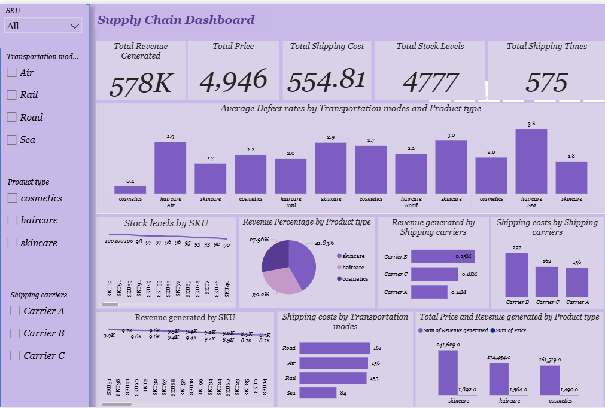

### ABOUT ME
Hello! I'm Olalekan Afolakemi 🤓, a data analyst, with hands-on experience in cleaning, analyzing, and visualizing data using tools like Excel, Power BI, and SQL. I enjoy working with raw data, transforming it into meaningful insights, and presenting results in a clear and simple way.

### WHAT I DO
*As a data analyst* I analyze datasets to uncover trends, patterns, and insights that support better decision-making. I work with structured data and focus on accuracy, clarity, and relevance.

###  Data Cleaning & Preparation
I clean and organize raw data by handling duplicates, missing values, incorrect formats, and inconsistencies to ensure data is ready for analysis.

### Data Visualization & Reporting
I create simple and clear dashboards and reports using charts, tables, and KPIs to communicate insights effectively to both technical and non-technical audiences.

### Business Metrics & Calculations
I calculate key performance indicators such as total sales, growth rates, averages, and comparisons (MoM, YoY) to track performance and  and measure results.

### 🛠 Tools I Use
- Microsoft Excel (Pivot Tables, formulas, data analysis)
- Power BI (DAX, dashboards, KPIs)
- SQL (basic data querying)

### MY PORTFOLIO 
*A glimpse of some of the projects I've been working on.*

**Supply Chain Dashboard**
This dataset contains supply chain information covering products, SKUs, transportation modes, carriers, pricing, shipping costs, stock levels, and defect rates. The dataset was analyzed to understand supply chain performance, identify cost and efficiency issues, monitor inventory levels, and support better operational and logistics decision-making.
 

[Read More](https://github.com/Olalekan4545/Supply-Chain-Shipping-Tracker-Analysis.git)

## CONTACT DETAILS

*Let’s connect and see how we can make a difference together!*
<table>
  <tbody>
    <tr>
      <td>📧</td>
      <td><a href="mailtoAfolakemiayomiposi@gmail.com">Afolakemiayomiposi@gmail.com</a></td>
    </tr>
    <tr>
      <td>📞</td>
      <td>(234) 810-653-1408</td>
    </tr>
    <tr>
      <td>📍</td>
      <td>Lagos, Nigeria</td>
    </tr>
    <tr>
      <td>⬇️</td>
      <td><a href="https://olalekan.github.io/portfolio1/docs/Profile.pdf">Download my CV</a></td>
    </tr>
    <tr>
      <td>🌐</td>
      <td><a href="https://linkedin.com/in/afolakemi-olalekan-145174253">My LinkedIn Profile</a></td>
    </tr>
    <tr>     
  </tbody>
</table>

