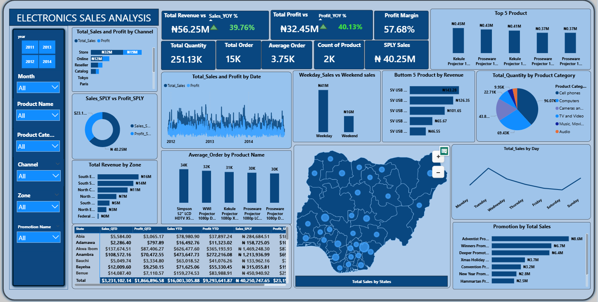
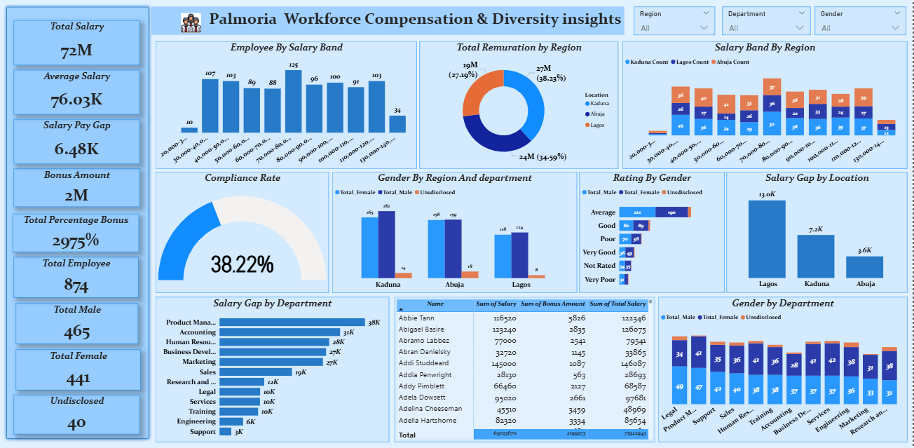
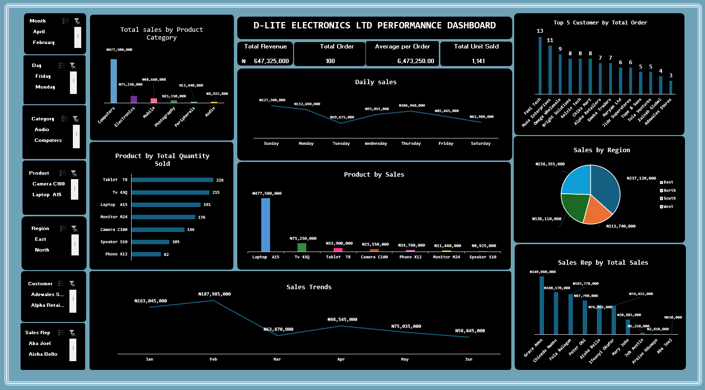
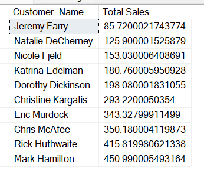
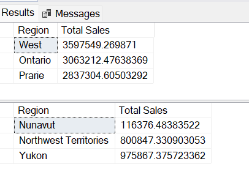

### ABOUT ME
I am Olalekan Afolakemi, a data analyst with hands-on experience in cleaning, analyzing, and visualizing data using tools such as Excel, Power BI, and SQL. I have worked on a range of data analytics projects across different industries, showcasing my versatility in handling diverse datasets and solving business problems. I enjoy working with raw data, transforming it into meaningful insights, and presenting results in a clear and simple way to support data-driven decision-making.

### WHAT I DO
*As a data analyst* I analyze datasets to uncover trends, patterns, and insights that support better decision-making. I work with structured data and focus on accuracy, clarity, and relevance.

###  Data Cleaning & Preparation
I clean and organize raw data by handling duplicates, missing values, incorrect formats, and inconsistencies to ensure data is ready for analysis.

### Data Visualization & Reporting
I create simple and clear dashboards and reports using charts, tables, and KPIs to communicate insights effectively to both technical and non-technical audiences.

### 🛠 Tools I Use
- Microsoft Excel (Pivot Tables, formulas, data analysis)
- Power BI (DAX, dashboards, KPIs)
- SQL (basic data querying)

### MY PORTFOLIO 
*A glimpse of some of the projects I've been working on.*

**Electronic Sales Performance Dashboard**
 
This Dashboard was developed with Powerbi to analyse electronics sales, profitability, product performance,regional and time-based trends in order to provide business stakeholders with insights to make data-driven decisions by tracking key business metrics over time.

[Read More](https://github.com/Olalekan4545/Electronic-Sales-Performance-Dashboard.git)

**Supply Chain Dashboard**
 
This dataset contains supply chain information covering products, SKUs, transportation modes, carriers, pricing, shipping costs, stock levels, and defect rates. The dataset was analyzed to understand supply chain performance, identify cost and efficiency issues, monitor inventory levels, and support better operational and logistics decision-making.

[Read More](https://github.com/Olalekan4545/Supply-Chain-Shipping-Tracker-Analysis.git)

**Palmoria-Workforce-Compensation-and-Diversity-Insights**
 
This project provides a granular analysis into the workforce structure of Palmoria. As a Data Analyst, my goal was to evaluate how compensation is distributed across the organization and to identify potential gaps in gender diversity and pay equity.

By analyzing salary, bonuses, and performance ratings, this dashboard serves as a strategic tool for leadership to ensure fair treatment and optimized budget allocation across all regions and departments.

[Read More](https://github.com/Olalekan4545/Palmoria-Workforce-Compensation-and-Diversity-Insights.git)

**D-LITE-ELECTRONICS-LTD-PERFORMANNCE-DASHBOARD**
 
This dashboard was developed using Excel, The project analyzes 6 months of **Electronics Sales data** and the analysis focus on regional sales density in **Nigeria**,the goal was to transform raw sales data into an interactive decision-making tool that tracks  product profitability, peak Busiest Day trends, staff performance, customer value, and operational timing  to assist stakeholders in strategic decision-making.

[Read More](https://github.com/Olalekan4545/D-LITE-ELECTRONICS-LTD-PERFORMANNCE-DASHBOARD.git)

**Kultra Mega Stores (KMS) Shipping Cost and Logistics Customer Analysis**

 

This project present a Comprehensive SQL-based analysis of KMS Sales Operations, which focus on the relationship between shipping cost,order of priority,cost optimization, customer and segment-level sales performannces. This analysis will enable kms makes informed descision about logistics strategy, customer engagement and revenue growth.

[Read More](https://github.com/Olalekan4545/Kultra-Mega-Stores-Sql-Analysis.git)

## CONTACT DETAILS

*Let’s connect and see how we can make a difference together!*
<table>
  <tbody>
    <tr>
      <td>📧</td>
      <td><a href="mailto:Afolakemiayomiposi@gmail.com">Send me a Mail</a></td>
    </tr>
    <tr>
      <td>📞</td>
      <td>(234) 810-653-1408</td>
    </tr>
    <tr>
      <td>📍</td>
      <td>Lagos, Nigeria</td>
    </tr>
    <tr>
      <td>⬇️</td>
      <td><a href="https://drive.google.com/file/d/1Jvr5g1I4m6S0agEyc9Ii2wVfFXAQdS7W/view?usp=drive_link">Download my CV</a></td>
    </tr>
    <tr>
      <td>🌐</td>
      <td><a href="https://linkedin.com/in/afolakemi-olalekan-145174253">My LinkedIn Profile</a></td>
    </tr>
    <tr>  
    <td>💻</td>
      <td><a href="https://github.com/Olalekan4545">My GitHub profile</a></td>
    </tr>
    <tr>     
  

